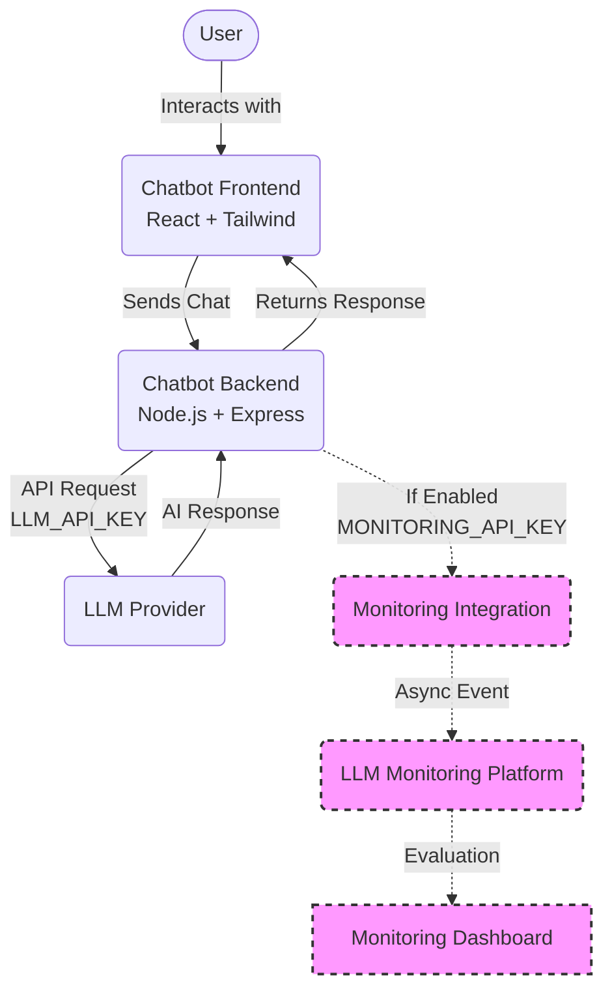

# AI Chatbot Application

A simple, production-quality AI chatbot built with React, TypeScript, Tailwind CSS, and Node.js. It features a modern chat interface and integrates with large language models (LLMs) to provide conversational AI capabilities.

This application is structurally designed to support future integration with an external LLM Monitoring and Evaluation Platform.

## Project Overview

The project consists of two main components:
1.  **Frontend (`/client`)**: A modern React application providing a user-friendly chat interface.
2.  **Backend (`/server`)**: A Node.js/Express server that acts as a secure intermediary between the frontend and the LLM API, and eventually handles sending evaluation data to a monitoring platform.

## Architecture Diagram



## Tech Stack

*   **Frontend**: React (Vite), TypeScript, Tailwind CSS (v4), Axios, Lucide React
*   **Backend**: Node.js, Express, TypeScript, Axios, @google/generative-ai (Gemini SDK)
*   **Security & Utils**: dotenv, cors, helmet, morgan, uuid

## Project Structure

```text
ai-chatbot/
├── client/                 # Frontend React Application
│   ├── src/
│   │   ├── components/chat/# Chat UI Components
│   │   ├── hooks/          # Custom React Hooks
│   │   ├── services/       # API Clients
│   │   ├── types/          # TypeScript Interfaces
│   │   ├── App.tsx         # Main Component
│   │   └── index.css       # Global Styles
│   └── package.json
│
└── server/                 # Backend Node.js Application
    ├── src/
    │   ├── config/         # Environment variables
    │   ├── controllers/    # API Controllers
    │   ├── integrations/   # External Integrations (Monitoring)
    │   ├── middleware/     # Express Middleware (Error handling)
    │   ├── routes/         # Express Routes
    │   ├── services/       # Business Logic & LLM
    │   ├── types/          # TypeScript Interfaces
    │   └── server.ts       # Application Entry
    └── package.json
```

## Installation & Setup

1.  **Clone the repository** (if applicable).
2.  **Install dependencies**:
    ```bash
    # Install server dependencies
    cd server
    npm install

    # Install client dependencies
    cd ../client
    npm install
    ```

3.  **Environment Variables**:
    *   In the `server` directory, copy `.env.example` to `.env`:
        ```bash
        cp .env.example .env
        ```
        Update `.env` with your LLM API Key (e.g., Gemini API Key).
    
    *   In the `client` directory, copy `.env.example` to `.env`:
        ```bash
        cp .env.example .env
        ```

## How to Run

You need two terminals to run the frontend and backend concurrently.

**Terminal 1 (Backend)**:
```bash
cd server
npm run dev
# Runs on http://localhost:5000
```

**Terminal 2 (Frontend)**:
```bash
cd client
npm run dev
# Runs on http://localhost:5173
```

Navigate to `http://localhost:5173` in your browser.

## API Documentation

### 1. Health Check
*   **URL**: `/api/v1/health`
*   **Method**: `GET`
*   **Success Response**:
    ```json
    {
      "success": true,
      "message": "Server is healthy"
    }
    ```

### 2. Chat Endpoint
*   **URL**: `/api/v1/chat`
*   **Method**: `POST`
*   **Headers**: `Content-Type: application/json`
*   **Request Body**:
    ```json
    {
      "conversationId": "opt-conv-id-123",
      "messages": [
        {
          "role": "user",
          "content": "What is JavaScript?"
        }
      ]
    }
    ```
*   **Success Response**:
    ```json
    {
      "success": true,
      "data": {
        "conversationId": "opt-conv-id-123",
        "message": {
          "role": "assistant",
          "content": "JavaScript is a programming language..."
        },
        "model": "gemini-1.5-flash",
        "provider": "google"
      }
    }
    ```

## Future Monitoring Platform Integration

This application includes a built-in integration layer (`server/src/integrations/monitoring`) designed to send AI interaction logs to an external **LLM Monitoring and Evaluation Platform**.

### How it works
When the user sends a message and the LLM responds, the `chat.service.ts` fires a non-blocking asynchronous event to `monitoring.service.ts`. If monitoring is enabled, this service securely sends the input/output pair (along with metadata) to your LLM Judge platform for evaluation.

### How to enable monitoring integration
By default, this feature is disabled. To enable it:

1. Open `server/.env`.
2. Set the following variables:
   ```env
   MONITORING_ENABLED=true
   MONITORING_API_URL=https://my-monitoring-platform.com/api/v1
   MONITORING_API_KEY=sk_live_xxxxxxxxx
   ```
3. Restart the backend server.

**Note**: The monitoring process is designed as "fire-and-forget". If the monitoring platform is down or unreachable, it will gracefully log an error internally but will **not** disrupt the chatbot experience or fail the user's request.
